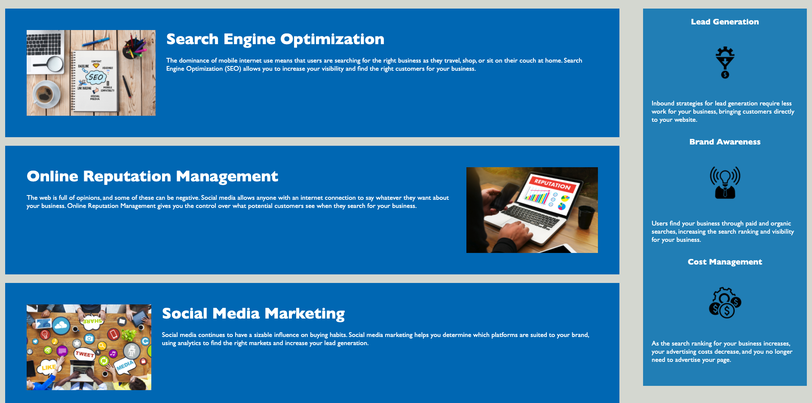

* HTML / CSS / Git Challenge 1: Code Refactor

* User Story:
AS A marketing agency
I WANT a codebase that follows accessibility standards
SO THAT our own site is optimized for search engines

* Acceptance Criteria:
GIVEN a webpage meets accessibility standards
WHEN I view the source code
THEN I find semantic HTML elements
WHEN I view the structure of the HTML elements
THEN I find that the elements follow a logical structure independent of styling and positioning
WHEN I view the image elements
THEN I find accessible alt attributes
WHEN I view the heading attributes
THEN they fall in sequential order
WHEN I view the title element
THEN I find a concise, descriptive title

* Description:
Refactored code for existing website, "Horiseon Social Solution Service" to meet accessibility standards, and ensure that people with disabilities can access the website using assistive technologies. In order to improve the codebase for long-term sustainability, I consolidated CSS selectors and properties, followed proper CSS and HTMl semantic structure, and commented throughout the file to help with clarity. 

* Screenshots:

* URL of Deployed Application:
https://aidanwanberg.github.io/Code-Refactor/ 

* URL of GitHub Repository:
https://github.com/aidanwanberg/Code-Refactor.git
